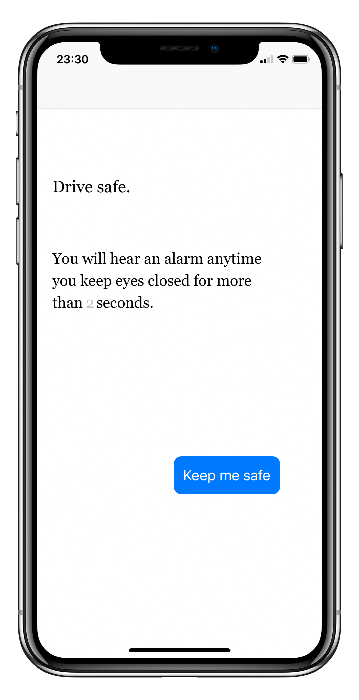

# Drive Safe

Drive Safe is an iOS app that plays a terrific alarm when you fall asleep while driving, trying to keep you safe while you try to have fun with your trips.

## License

For any part of this work for which the license is applicable, this work is licensed under the [Attribution-NonCommercial-NoDerivatives 4.0 International](http://creativecommons.org/licenses/by-nc-nd/4.0/) license. See LICENSE.CC-BY-NC-ND-4.0.

Any part of this work for which the CC-BY-NC-ND-4.0 license is not applicable is licensed under the [Mozilla Public License 2.0](https://www.mozilla.org/en-US/MPL/2.0/). See LICENSE.MPL-2.0.

Any part of this work that is known to be derived from an existing work is licensed under the license of that existing work. Where such license is known, the license text is included in the LICENSE.ext file, where "ext" indicates the license.

&copy; 2020 Denis Mullaraj
