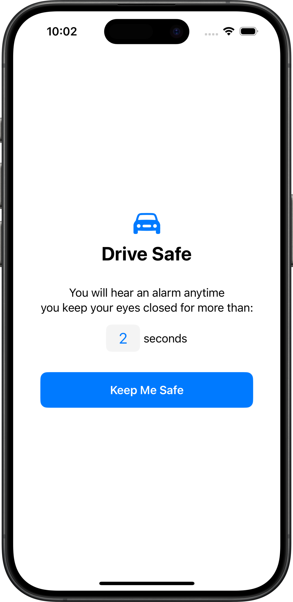

# Drive Safe

**Drive Safe** is an iOS app designed to help prevent dangerous situations on the road. It uses innovative technology to monitor your eyes while driving. If the app detects that your eyes are closed for too long, it will trigger a loud alarm to wake you up and keep you safe. Whether you're on a long trip or just out for a drive, Drive Safe ensures that you stay alert and focused.

<p align="center">

</p>

## Features

- **Eye Tracking:** The app uses real-time eye tracking to monitor your eye activity and detect when your eyes are closed for too long.
- **Alarm Notification:** If you fall asleep while driving, an alarm will be triggered to alert you.
- **Customizable Settings:** The maximum time you can keep your eyes closed before triggering the alarm is adjustable to suit your preferences.
- **User-Friendly Interface:** With clear instructions and an easy-to-use interface, Drive Safe makes sure you're always ready for your next trip.

## How It Works

Drive Safe uses the **ARKit framework**, a powerful augmented reality (AR) technology by Apple, to track your eye movements. By utilizing the **TrueDepth camera** available in modern iPhones (iPhone X and later), the app monitors your face and specifically your eyes. It checks for eye blinks and detects when your eyes are closed for extended periods of time. 

### How Eye Tracking Works in Drive Safe

1. **Face Tracking:** The app uses ARKit's face tracking capabilities to monitor your facial expressions and detect whether your eyes are open or closed. It specifically tracks your left and right eyes using **blend shapes** that represent different eye movements.

2. **Alarm Trigger:** If both of your eyes are closed for longer than the maximum time you’ve set in the preferences, the app will trigger an alarm. The app tracks time continuously and responds to any changes in your eye position or blink patterns.

3. **Real-Time Feedback:** The app provides real-time feedback to the user. If the eyes remain closed for too long, the system triggers an alarm that plays through the device’s speakers, alerting you to wake up.

### Requirements

- **iPhone X or later:** The app requires an iPhone with the TrueDepth camera (iPhone X and later) to use the ARKit-based eye tracking feature.
- **iOS 14.0 or later:** The app is compatible with devices running iOS 14 or newer, as it uses SwiftUI's `@main` attribute, which is available only in iOS 14 and later.

## Installation

1. Clone the repository:
    ```
    git clone https://github.com/denismullaraj/drivesafe-ios.git
    ```

2. Open the project in **Xcode**.

3. Build and run the app on a device with a TrueDepth camera (iPhone X or later).

## Customization

- **Max Time Eyes Can Be Closed:** You can adjust the maximum duration (in seconds) that you can keep your eyes closed before triggering the alarm. This can be changed in the settings screen of the app.

## License
[](https://creativecommons.org/licenses/by-nc-nd/4.0/)

For any part of this work for which the license is applicable, this work is licensed under the [Attribution-NonCommercial-NoDerivatives 4.0 International](http://creativecommons.org/licenses/by-nc-nd/4.0/) license. See LICENSE.CC-BY-NC-ND-4.0.

Any part of this work for which the CC-BY-NC-ND-4.0 license is not applicable is licensed under the [Mozilla Public License 2.0](https://www.mozilla.org/en-US/MPL/2.0/). See LICENSE.MPL-2.0.

Any part of this work that is known to be derived from an existing work is licensed under the license of that existing work. Where such license is known, the license text is included in the LICENSE.ext file, where "ext" indicates the license.

&copy; 2020 Denis Mullaraj